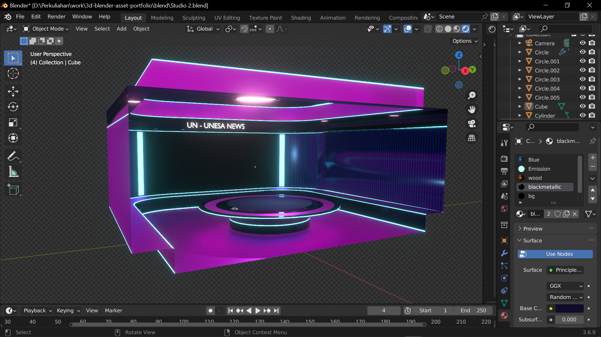
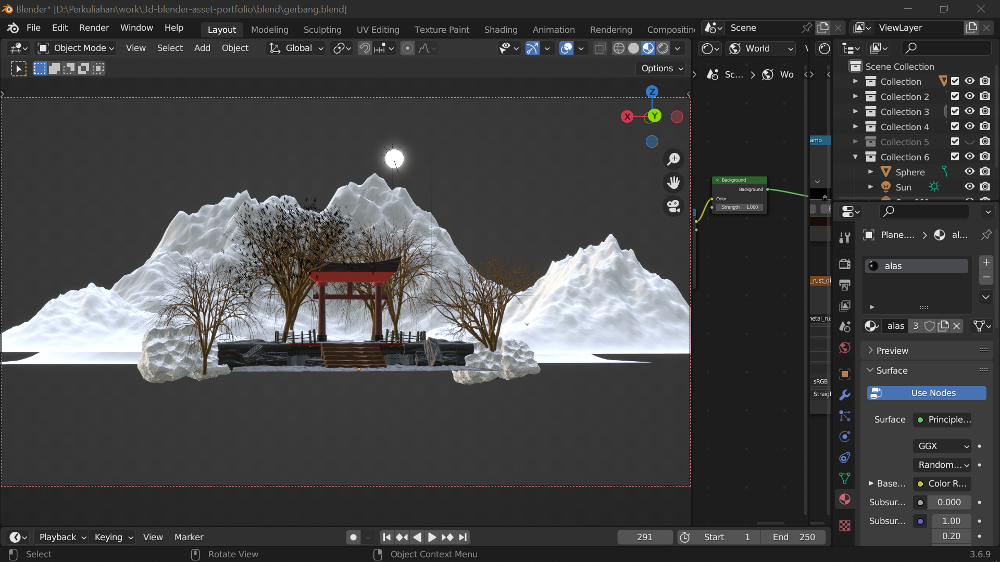

# Blender 3D Asset – Learning Portfolio

## Overview
This repository contains a collection of **3D assets created using Blender** as part of my learning process in 3D modeling and texturing.

The assets were developed for **personal skill development**, including practice conducted during an **internship program**.  
All work presented here is non-proprietary and intended solely for learning and portfolio purposes.

In total, this repository includes **55 simple 3D assets** with various object types.

---

## What I Practiced
- 3D Modeling
- UV Mapping
- Texturing & Material Setup

---

## Asset Preview
Below are selected assets that represent the overall collection:

---

## Tools
- Blender 3D

---

## Notes
- This repository is intended for **learning and portfolio demonstration**
- Assets are **not intended for commercial use**
- No confidential or proprietary company data is included
